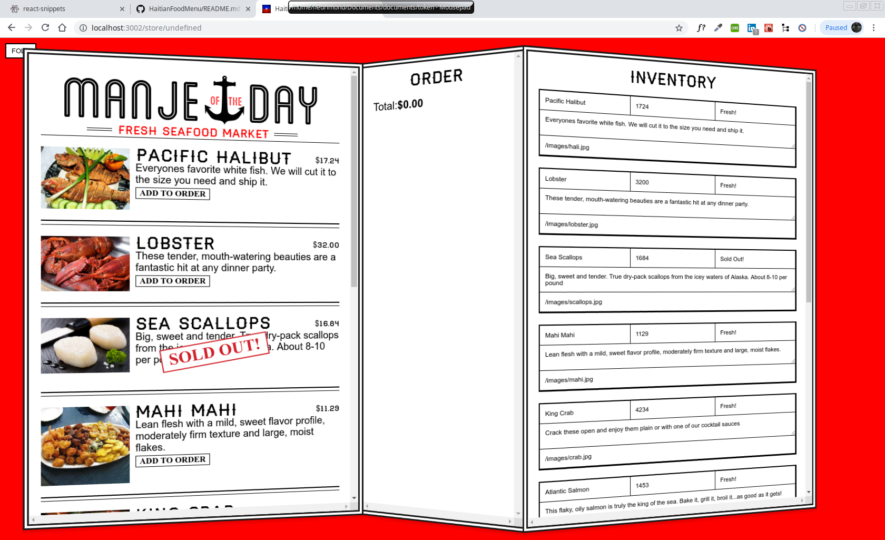
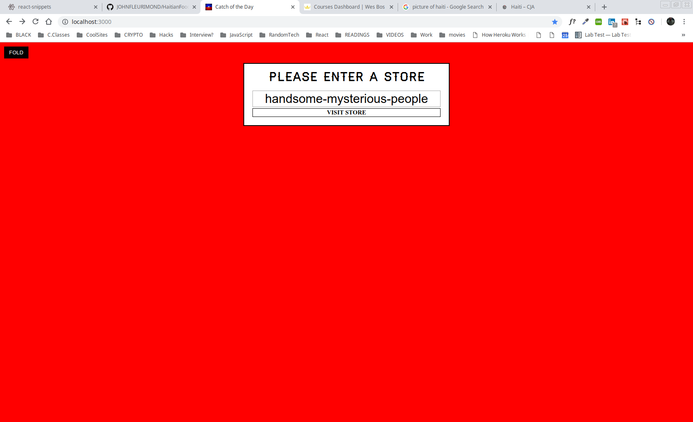

# My Awesome Project
A Haitian Food Cuisine Menu! Check it out---> https://haitianfoodmenu.herokuapp.com/

A real-time react app for a trendy Haitian food and seafood market where price and quantity available are variable and can change at a moment's notice. We will build a menu, an order form, and an inventory management area where authorized users can immediately update product details even change stores while having the ability to store the data that was already entered in a different store!
REACT is awesome!!!!

I learned to use keys to store values in localStorage, state, dynamic props, React Router,  and new ES6 syntax/magic in order to cut down on code when retrieving the value from an input!

And got this running on Heroku, that was a big plus!!!! I ran in to big issues because of the whole `create-react-app`. Create-react-app is a great tool for utilizing React, and while it does a lot of the heavy lifting for me - in terms of setup and scaffolding a project -I had still need to have the ability to set the Port on my app.Most Node.js apps bind to a specific port by default. For example, Express uses the following:

```app.listen(3000, function () {
  console.log('Example app listening on port 3000!');
});
```

However, Heroku dynos expose a dynamic port for your app to bind to. This value is exposed in the $PORT env var. You must change your code to bind to this port instead. For example:

```
const PORT = process.env.PORT || 3000;
app.listen(PORT, () => {
    console.log(`Our app is running on port ${ PORT }`);
});
```

 So I made a small express backend to server you React app with. Push to Heroku and bang! Deploy successful


## How It's Made:
This application is made with React and deployed on Heroku.

## Installation

1. Clone repo
2. run `npm install`

## Usage

1. run `npm start`
