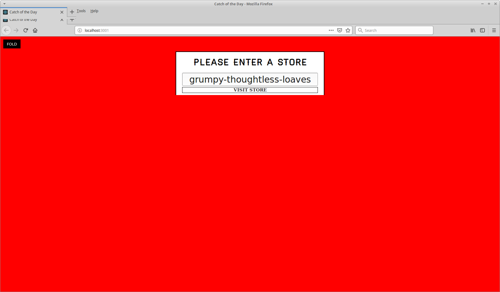

# My Awesome Project
A Haitian Food Cuisine Menu! Check it out--->

A real-time react app for a trendy Haitian food and seafood market where price and quantity available are variable and can change at a moment's notice. We will build a menu, an order form, and an inventory management area where authorized users can immediately update product details even change stores while having the ability to store the data that was already entered in a different store!
REACT is awesome!!!!

I learned to use keys to store values in localStorage, state, dynamic props, React Router,  and new ES6 syntax/magic in order to cut down on code when retrieving the value from an input!

And got this running on Heroku, that was a big plus!

## How It's Made:
This application is made with React.

## Installation

1. Clone repo
2. run `npm install`

## Usage

1. run `npm start`
